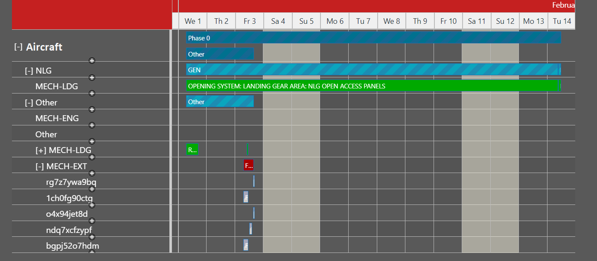

# Aircraft Maintenance Planning Backend
This software component is the backend service that manages revision planning.

## Description 

### Data model
A revision plan is a hierarchical structure of plan parts organized in 5 layers listed from general to specific
- phase plan layer - this layer contains phases of the revision plan which may around 5 phases.
- general task plan layer - this layer organizes specific tasks into general categories such as _Check_, _Repair_ and _Restoration_
- task plan layer - this layer contains specific maintenance tasks, e.g. _INSPECT ENGINE 1_.    
- work session layer - this layer contains work session  

Each plan in the plan contains both actual and planned start and end as well as a reference to a resource which is 
involved in the task. The plan resources are assigned as follows:
- phase plan layer - each phase plan is associated with the aircraft 
- the general task plan layer - references an aircraft area
- task plan layer - references mechanic groups
- work session layer - references mechanics

Here is an example of a plan shown in the plan-manager client. The resources associated with each plan part are shown 
on the left. The calendar on the right shows the plan parts.

### Planning
The plan structure is constructed based on structured description of maintenance tasks from maintenance manuals stored
in the data storage. Each description may specify the phase, general task category, maintenance group as well as statistical
estimates such as duration estimate.

Scheduling of the plan is based on historical plans. First, the data storage is queried for similar plans which are then 
ordered according to a similarity measure which compares the number of common maintenance tasks. The order of tasks 
is reused from the found similar revision plans. The new task plans are scheduled based on the order extracted from the 
similar plans.    

## Required Technologies

- JDK 11 or newer
- Apache Maven 3.6.x or newer

## System Architecture
The service accessed by [plan manager]()
to allow end users to manage revision plans. The service is also connected to data storage component where 
data used for planning is stored, .e.g. work sessions, task types, workers. To secure access to sensitive data this
component may be configured to connect to a Keycloak server supporting single sign on (SSO).

#### Data Storage
The data storage is an RDF repository accessible as a web service. The application was developed using GraphDB. The data
are stored according to the ontology schema.

#### Software Component Communication 
The communication with the client is implemented as a web service following REST conventions where possible. The 
communication format is JSON/JSON-LD.

#### Security
This software component is deployed in the security realm hosted on a Keycloak security service. 

## Technologies
The main technologies and principles used (or planned to be used) in the application are:
- Spring Boot 2.5, Spring Framework 5.5, Spring Security
- Jackson 2.12
- org.jgrapht 1.5.1
- [JB4JSON-LD](https://github.com/kbss-cvut/jb4jsonld-jackson)* - Java - JSON-LD (de)serialization library
- [JOPA](https://github.com/kbss-cvut/jopa) - persistence library for the Semantic Web
- JUnit 5*,
- SLF4J + Logback

## Ontology
This software component uses several ontologies which are referenced the file `src/main/resource/mapping`. The application 
ontology contains a model specific to this software component, and it is stored in the `src/main/resource` folder. The 
rest of the used ontologies can be located in the `aircraft-maintenance-planning-model` folder in the root of this 
repository. 

## Dockerization
A docker image can be build via the command:

`docker build -t maintenance-planning-server`

Then, maintenance planning server can be run and exposed at the port 8080 as:

`sudo docker run -e REPOSITORY_DATA_URL=<GRAPHDB_REPOSITORY_URL> -p 8080:8080 maintenance-planning-server`

The argument `<GRAPHDB_REPOSITORY_URL>` points to the GraphDB repository.

## License

Licensed under LGPL v3.0.